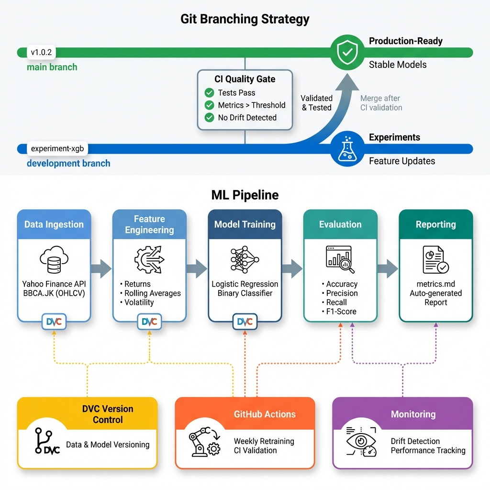
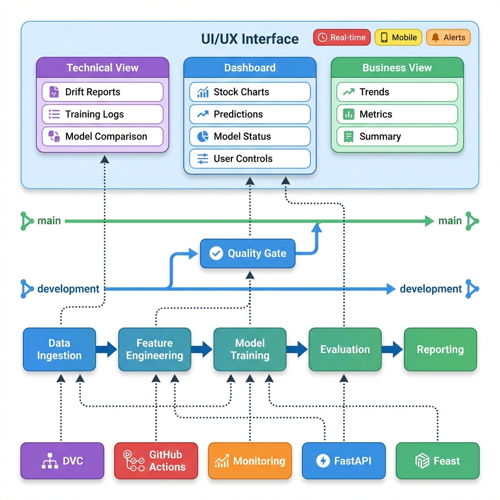

# StockFlowML

> **Production-ready MLOps Pipeline** for Stock Trend Prediction using Indonesian Stock Exchange data

[](https://www.python.org/downloads/)
[](https://opensource.org/licenses/MIT)

## 🎯 Project Overview

StockFlowML is an end-to-end **MLOps pipeline** that demonstrates industry-standard practices for machine learning in production. The system predicts next-day stock price trends (up/down) using historical OHLCV data and technical indicators.

**Key Principles:**
- ✅ **Reproducibility**: Every experiment is tracked and reproducible via DVC
- ✅ **Automation**: Automated weekly retraining via GitHub Actions
- ✅ **Clean Architecture**: Modular, testable, maintainable code
- ✅ **Production-Ready**: Built for scalability and monitoring

## 🏗️ Architecture

### MLOps Workflow



*Complete MLOps workflow with Git branching strategy, CI/CD pipeline, and automated monitoring*

### Architecture with UI/UX Layer



*Extended architecture showing end-to-end system including UI/UX interface layer for user interaction*

**UI/UX Interface Layer:**
- **Technical View** (Purple): Drift reports, training logs, model comparison for ML engineers
- **Dashboard** (Blue): Stock charts, predictions, model status, and user controls
- **Business View** (Green): Simplified trends, metrics, and executive summaries
- **Future Features**: Real-time data, mobile interface, alert notifications

**Data Flow:**
- Backend components (DVC, GitHub Actions, Monitoring, FastAPI, Feast) feed data into UI layer
- Quality Gate ensures only validated models and tested UI reach production
- Development branch for experimentation, main branch for stable releases

### Development Workflow

- **main branch**: Production-ready models with validated performance
- **development branch**: Experimentation and feature updates  
- **CI Quality Gate**: Automated checks before merge (tests, metrics thresholds, drift detection)

**Pipeline Stages:**
1. **Data Ingestion**: Download OHLCV data from Yahoo Finance (BBCA.JK default)
2. **Feature Engineering**: Create returns, rolling averages, and volatility features
3. **Model Training**: Train Logistic Regression baseline
4. **Evaluation**: Calculate accuracy, precision, recall, F1-score
5. **Reporting**: Generate markdown metrics report

**MLOps Components:**
- **DVC**: Version control for data and models
- **GitHub Actions**: Weekly automated retraining + CI validation
- **Monitoring**: Drift detection and performance tracking

## 📊 Features

### Level 1 (Implemented) ✅
- [x] Automated data fetching from Yahoo Finance
- [x] **Data Quality Framework**:
  - [x] Comprehensive data validation (schema, financial integrity, temporal checks)
  - [x] Data feasibility assessment (6 production-ready criteria)
  - [x] Automated quality reporting (`data_quality_report.md`, `data_feasibility.md`)
  - [x] CSV fallback for offline/demo use
- [x] Feature engineering with rolling windows
- [x] Binary classification (price up/down prediction)
- [x] Logistic Regression baseline model
- [x] XGBoost support (optional)
- [x] Comprehensive evaluation metrics
- [x] DVC for data/model versioning
- [x] GitHub Actions for weekly retraining
- [x] Markdown-based experiment logging
- [x] Production-grade testing suite

### Level 2 (Implemented) ✅
- [x] **Evidently AI for drift detection**
  - [x] Data drift detection (feature distribution changes)
  - [x] Target drift detection (label distribution changes)
  - [x] HTML/JSON/Markdown drift reports
  - [x] CLI drift report generator
- [x] **Alert System**
  - [x] Discord webhook integration
  - [x] Drift detection alerts
  - [x] Performance degradation alerts
  - [x] Training completion notifications
- [x] **Data quality monitoring** (integrated with Level 1)
- [x] **Threshold-based alerting**

### Level 3 (Implemented) ✅
- [x] **FastAPI prediction serving**
  - [x] Health check & inference endpoints
  - [x] Pydantic schema validation
  - [x] Model hot-loading
  - [x] CORS middleware
  - [x] Error handling and logging
- [x] **Feast feature store**
  - [x] Feature definitions and registry
  - [x] SQLite online store (dev)
  - [x] Parquet offline store
  - [x] Feature materialization scripts
  - [x] Ticker-based prediction endpoint
- [x] **Real-time inference**
  - [x] Low-latency predictions (< 100ms)
  - [x] Feature retrieval from Feast
  - [x] Async API endpoints
- [x] **Docker deployment**
  - [x] Production-ready Dockerfile
  - [x] Docker Compose with Redis
  - [x] Health checks and auto-restart
  - [x] Volume mounts for models
  - [x] Multi-service orchestration

## 🚀 Quick Start

### Prerequisites

- Python 3.11+
- Git
- Virtualenv (recommended)

### Installation

```bash
# Clone repository
git clone https://github.com/loxleyftsck/StockFlowML.git
cd StockFlowML

# Create virtual environment
python -m venv venv
source venv/bin/activate  # Linux/Mac
# or
venv\Scripts\activate  # Windows

# Install dependencies
pip install -r requirements.txt

# Initialize DVC
dvc init
```

### Running the Pipeline

**Full pipeline (recommended):**
```bash
python -m pipelines.train_pipeline
```

**Step-by-step:**
```bash
# 1. Download data
python src/data/data_loader.py

# 2. Feature engineering
python src/features/feature_engineering.py

# 3. Train model
python src/models/train.py

# 4. Evaluate model
python src/evaluation/evaluate.py
```

**With custom ticker:**
```bash
python -m pipelines.train_pipeline --ticker TLKM.JK --model logistic
```

### View Results

After training, check:
- **Model Metrics**: `reports/metrics.md` (training performance)
- **Data Quality Report**: `reports/data_quality_report.md` (validation results)
- **Data Feasibility Report**: `reports/data_feasibility.md` (production readiness)
- **Trained Model**: `models/logistic_model.pkl`
- **Processed Data**: `data/processed/BBCA.JK_processed.csv`

### Level 2: Monitoring & Drift Detection

**Detect data drift:**
```bash
# Auto-split mode (uses 70% as reference, 30% as current)
python scripts/generate_drift_report.py --ticker BBCA.JK --split 0.7

# Explicit mode (compare two datasets)
python scripts/generate_drift_report.py \
  --reference data/processed/BBCA.JK_baseline.csv \
  --current data/processed/BBCA.JK_today.csv
```

**View drift reports:**
- **Interactive HTML**: `reports/drift_report.html` (Evidently AI visualization)
- **Programmatic JSON**: `reports/drift_report.json` (for automation)
- **Executive Summary**: `reports/drift_report.md` (markdown summary)

**Send Discord alerts** (requires `DISCORD_WEBHOOK_URL` env var):
```bash
# Set webhook URL
export DISCORD_WEBHOOK_URL="https://discord.com/api/webhooks/YOUR_WEBHOOK_HERE"

# Generate report with alerts
python scripts/generate_drift_report.py --ticker BBCA.JK --send-alert
```

**Test alert system:**
```bash
python -m src.monitoring.alerts
```

### Level 3: FastAPI Serving

**Start the API Server:**
```bash
# Start server with auto-reload (dev)
python -m uvicorn src.api.app:app --host 0.0.0.0 --port 8000 --reload
```

**API Endpoints:**
- **Health Check**: `GET /health` - Check API and model status
- **Predict**: `POST /predict` - Get model prediction

**Example Prediction Request:**
```json
{
  "Open": 4500.0,
  "High": 4550.0,
  "Low": 4480.0,
  "Close": 4520.0,
  "Volume": 10000000.0,
  "returns": 0.005,
  "ma_5": 4480.0,
  "ma_10": 4470.0,
  "ma_20": 4450.0,
  "volatility_5": 0.012,
  "volatility_10": 0.013,
  "volatility_20": 0.015
}
```

**Test Integration:**
```bash
python tests/test_api_integration.py
```

**Run with Docker:**
```bash
# Build and run
docker-compose up --build -d

# Check logs
docker-compose logs -f

# Stop
docker-compose down
```

**What drift detection monitors:**
- Feature distribution changes (data drift)
- Target label distribution changes (target drift)
- Threshold-based alerting (50% feature drift or 0.3 target drift score)
- Automatic recommendations for retraining

### Level 3: Production Serving & Feature Store

**Start the API Server:**
```bash
# Development mode with auto-reload
python -m uvicorn src.api.app:app --host 0.0.0.0 --port 8000 --reload

# Production mode with multiple workers
python -m uvicorn src.api.app:app --host 0.0.0.0 --port 8000 --workers 4
```

**API Endpoints:**
- **Root**: `GET /` - Welcome message
- **Health Check**: `GET /health` - Check API and model status
- **Predict (Manual)**: `POST /predict` - Prediction with manual features
- **Predict (Ticker)**: `POST /predict/ticker` - Prediction using Feast feature store

**Example 1: Manual Prediction**
```bash
curl -X POST http://localhost:8000/predict \
  -H "Content-Type: application/json" \
  -d '{
    "Open": 4500.0,
    "High": 4550.0,
    "Low": 4480.0,
    "Close": 4520.0,
    "Volume": 10000000.0,
    "returns": 0.005,
    "ma_5": 4480.0,
    "ma_10": 4470.0,
    "ma_20": 4450.0,
    "volatility_5": 0.012,
    "volatility_10": 0.013,
    "volatility_20": 0.015
  }'
```

**Example 2: Ticker-based Prediction (Feast)**
```bash
curl -X POST http://localhost:8000/predict/ticker \
  -H "Content-Type: application/json" \
  -d '{
    "ticker": "BBCA.JK",
    "timestamp": null
  }'
```

**Setup Feast Feature Store:**
```bash
# 1. Prepare feature data (convert CSV to Parquet)
python feature_store/materialize_features.py --ticker BBCA.JK --prepare-only

# 2. Initialize Feast registry
cd feature_store/feature_repo
feast apply
cd ../..

# 3. Materialize features to online store
python feature_store/materialize_features.py --ticker BBCA.JK --days 30
```

**Run with Docker:**
```bash
# Build and start all services (API + Redis)
docker-compose up --build -d

# Check service status
docker-compose ps

# View logs
docker-compose logs -f api

# Test API
curl http://localhost:8000/health
### Level 3: Production Serving & Dashboard

**Start the complete stack (API + Redis + Frontend)**:

**Backend (API + Redis)**:
```bash
# Terminal 1: Start backend services
docker-compose up

# Or run API standalone
python -m uvicorn src.api.app:app --host 0.0.0.0 --port 8000 --reload
```

**Frontend Dashboard**:
```bash
# Terminal 2: Start frontend
cd frontend
npm install
npm run dev

# Open browser
# http://localhost:3000
```

**Access Dashboard**:
- Main Dashboard: http://localhost:3000
- API Docs: http://localhost:8000/docs
- Health Check: http://localhost:8000/health

## 📁 Project Structure

```plaintext
StockFlowML/
├── .github/
│   └── workflows/
│       └── retrain.yml          # Weekly automated retraining
├── data/
│   ├── raw/                     # Downloaded stock data (DVC tracked)
│   ├── processed/               # Engineered features (DVC tracked)
│   │   └── feast_features.parquet  # Feast-compatible features
│   ├── fallback/                # CSV snapshots for offline/demo use
│   ├── online_store.db          # Feast online store (SQLite)
│   └── registry.db              # Feast registry
├── models/                      # Trained models (DVC tracked)
├── reports/
│   ├── metrics.md               # Training performance metrics
│   ├── data_quality_report.md   # Data validation results
│   ├── data_feasibility.md      # Production readiness assessment
│   ├── drift_report.html        # Interactive drift visualization (Level 2)
│   ├── drift_report.json        # Drift metrics for automation (Level 2)
│   ├── drift_report.md          # Drift summary report (Level 2)
│   ├── level2_completion_report.md  # Level 2 completion summary
│   └── level3_completion_report.md  # Level 3 completion summary
├── docs/
│   ├── images/
│   │   └── mlops_workflow.png   # MLOps architecture diagram
│   ├── DEPLOYMENT.md            # Deployment guide (Level 3)
│   └── BRANCHING_STRATEGY.md    # Git workflow
├── scripts/
│   ├── generate_data_quality_report.py    # Data validation report
│   ├── generate_feasibility_report.py     # Feasibility assessment
│   ├── generate_drift_report.py           # Drift detection report (Level 2)
│   ├── generate_fallback_data.py          # Create CSV snapshots
│   └── generate_synthetic_data.py         # Demo data generator
├── src/
│   ├── data/
│   │   ├── data_loader.py       # Yahoo Finance data download
│   │   ├── data_validation.py   # Data contract validation
│   │   └── data_feasibility.py  # Production readiness checks
│   ├── features/
│   │   └── feature_engineering.py  # Rolling windows, returns
│   ├── models/
│   │   └── train.py             # Logistic Regression & XGBoost
│   ├── evaluation/
│   │   └── evaluate.py          # Metrics calculation & reporting
│   ├── monitoring/              # Level 2: Monitoring & Drift Detection
│   │   ├── drift_detector.py    # Evidently AI drift detection
│   │   ├── alerts.py            # Discord/Email alert system
│   │   └── __init__.py          # Monitoring module exports
│   ├── api/                     # Level 3: FastAPI serving
│   │   ├── app.py               # Main API application
│   │   ├── schemas.py           # Pydantic request/response models
│   │   ├── __init__.py
│   │   └── README.md
│   └── utils/
│       └── config.py            # Centralized configuration
├── feature_store/               # Level 3: Feast feature store
│   ├── feature_repo/
│   │   ├── feature_store.yaml   # Feast configuration
│   │   ├── features.py          # Feature view definitions
│   │   └── __init__.py
│   ├── materialize_features.py  # Feature materialization script
│   └── README.md                # Feature store documentation
├── pipelines/
│   └── train_pipeline.py        # End-to-end orchestration
├── tests/
│   ├── test_pipeline.py         # Integration tests
│   ├── test_data_validation.py  # Data contract tests
│   ├── test_data_feasibility.py # Feasibility criteria tests
│   └── test_api_integration.py  # API integration tests (Level 3)
├── Dockerfile                   # Docker image definition (Level 3)
├── docker-compose.yml           # Multi-service orchestration (Level 3)
├── dvc.yaml                     # DVC pipeline definition
├── requirements.txt             # Python dependencies
├── requirements-dev.txt         # Development dependencies
└── README.md                    # This file
```

---

## 🔒 Data Contract & Quality

> **Production Rule**: No model training occurs unless data passes all validation checks.

### Why Data Quality Matters in Finance

Financial time-series data requires rigorous validation because:
- **Market integrity**: Invalid OHLC relationships indicate data corruption
- **Model reliability**: Garbage in = garbage out - invalid data destroys model performance
- **Regulatory compliance**: Financial systems require auditable data provenance
- **Risk management**: Silent data errors can lead to catastrophic trading decisions

### Data Contract Specification

All data (Yahoo Finance or CSV snapshots) MUST conform to this contract:

#### 1. Schema Requirements
- **Columns**: Date, Open, High, Low, Close, Volume (exact names)
- **Types**:
  - Date: datetime64
  - OHLC: float64
  - Volume: int64

#### 2. Time Properties
- **Frequency**: Daily (one row per trading day)
- **Trading days**: Weekdays only (no weekends)
- **Sorted**: Ascending chronological order
- **Unique**: No duplicate timestamps

#### 3. Financial Validity
- **Positive prices**: Open, High, Low, Close > 0
- **Non-negative volume**: Volume >= 0
- **OHLC relationships**:
  - Low <= Open <= High
  - Low <= Close <= High
  - High >= Low

#### 4. Data Integrity
- **No missing values**: OHLCV columns must be complete
- **No forward-filling**: Missing days are dropped (not filled)
- **No future leakage**: Target generation validated

### Validation Process

```python
# Data is automatically validated during loading
from src.data.data_loader import StockDataLoader
from src.data.data_validation import validate_dataframe

loader = StockDataLoader("BBCA.JK")
df = loader.download_data()
df = loader.clean_data(validate=True)  # Explicit validation

# Check validation stats
print(loader.validation_stats)
```

**Validation Checks**:
1. Schema validation (columns, types)
2. Time properties (sorted, no duplicates)
3. Financial integrity (OHLC relationships, positive prices)
4. Missing data detection (no NaNs in OHLCV)

### Data Quality Report

Generate data quality report:

```bash
python scripts/generate_data_quality_report.py --ticker BBCA.JK
```

View report at: `reports/data_quality_report.md`

### Validation Failures

All validation failures raise `DataValidationError` with actionable messages:

```
DataValidationError: Financial integrity validation failed for BBCA.JK:
Removed 15 invalid rows (15.0%). Threshold: 10%.
Invalid row breakdown: {'high_less_than_low': 8, 'negative_prices': 7}.
Action: Investigate data source quality.
```

**No silent fixes.** All data cleaning is logged and auditable.

### Data Feasibility Assessment

Beyond basic validation, StockFlowML includes **production readiness checks**:

```bash
python scripts/generate_feasibility_report.py --ticker BBCA.JK
```

**6 Production-Ready Criteria**:
1. ✅ **Minimum Samples**: >= 100 trading days for statistical validity
2. ✅ **Data Completeness**: >= 90% of OHLCV data present
3. ✅ **Temporal Continuity**: No gaps > 10 trading days
4. ✅ **Outlier Detection**: < 1% extreme outliers (Z-score > 4.0)
5. ✅ **Label Balance**: Minority class between 20-80%
6. ✅ **Look-Ahead Bias**: No features with future information

View report at: `reports/data_feasibility.md`

## 🛠️ Utility Scripts

StockFlowML includes production-ready scripts for data management and reporting:

### Data Quality & Validation

```bash
# Generate comprehensive data quality report
python scripts/generate_data_quality_report.py --ticker BBCA.JK

# Generate production feasibility assessment
python scripts/generate_feasibility_report.py --ticker DEMO

# Validate real Yahoo Finance data (detailed analysis)
python scripts/generate_model_validation_report.py
```

### Data Management

```bash
# Create CSV snapshot for offline use
python scripts/generate_fallback_data.py --ticker BBCA.JK --days 180

# Generate synthetic OHLCV data for demos
python scripts/generate_synthetic_data.py --ticker DEMO --days 500

# Check snapshot freshness
python scripts/check_snapshot.py
```

**All scripts support**:
- Multiple ticker symbols
- Configurable parameters
- Markdown report generation
- Error handling with clear messages

---

## 🔬 Model Details

### Input Features

**Price-based:**
- Daily returns: `(Close[t] - Close[t-1]) / Close[t-1]`

**Rolling Statistics:**
- Moving averages (5, 10, 20 days)
- Rolling volatility (std of returns, 5/10/20 days)

**Raw OHLCV:**
- Open, High, Low, Close, Volume

### Target Variable

**Binary Classification:**
- `target = 1` if `Close[t+1] > Close[t]` (price goes UP tomorrow)
- `target = 0` if `Close[t+1] <= Close[t]` (price goes DOWN tomorrow)

### Models

1. **Logistic Regression** (Default)
   - Baseline linear classifier
   - Fast training, interpretable
   - Class-balanced for imbalanced data

2. **XGBoost** (Optional)
   - Gradient boosting ensemble
   - Better performance, longer training
   - Use: `--model xgboost`

### Evaluation Metrics

- **Accuracy**: Overall correctness
- **Precision**: When predicting UP, how often correct?
- **Recall**: Of all UP days, how many caught?
- **F1-Score**: Harmonic mean of precision/recall
- **Confusion Matrix**: Detailed breakdown

## 🔄 CI/CD Pipeline

### Automated Retraining

**Schedule**: Every Friday at 16:00 WIB (after market close)

**GitHub Actions Workflow:**
1. Download latest stock data
2. Run feature engineering
3. Train model
4. Evaluate performance
5. Update `reports/metrics.md`
6. Auto-commit results

**Manual Trigger:**
```bash
# Via GitHub UI: Actions → Weekly Model Retraining → Run workflow
```

### DVC Workflow

```bash
# Reproduce entire pipeline
dvc repro

# Pull data/models from remote
dvc pull

# Push updated artifacts
dvc push
```

## 🧪 Testing

```bash
# Run all tests
pytest

# With coverage
pytest --cov=src --cov-report=html

# View coverage report
open htmlcov/index.html
```

## 📈 Performance Expectations

**Baseline Performance (BBCA.JK, 5 years):**
- Training Accuracy: ~52-55%
- Test Accuracy: ~50-53%

> **Note**: Stock prediction is inherently difficult. Accuracy >50% is better than random. Focus is on MLOps practices, not achieving high accuracy.

## 🛠️ Development

### Adding New Features

1. Edit `src/features/feature_engineering.py`
2. Add new feature calculation methods
3. Update `create_all_features()`
4. Re-run pipeline

### Using Different Stocks

```bash
# Indonesian stocks (IDX)
python -m pipelines.train_pipeline --ticker TLKM.JK  # Telkom
python -m pipelines.train_pipeline --ticker BMRI.JK  # Bank Mandiri

# US stocks
python -m pipelines.train_pipeline --ticker AAPL  # Apple
```

### Hyperparameter Tuning

Edit model parameters in `src/models/train.py`:

```python
# Logistic Regression
LogisticRegression(
    C=1.0,  # Regularization strength
    max_iter=1000,
    solver='lbfgs'
)

# XGBoost
XGBClassifier(
    n_estimators=100,  # Number of trees
    max_depth=5,       # Tree depth
    learning_rate=0.1
)
```

## 📚 MLOps Concepts Demonstrated

| Concept | Implementation |
| **Data Versioning** | DVC tracks raw data, processed features, models |
| **Reproducibility** | `dvc.yaml` defines exact pipeline stages |
| **Automation** | GitHub Actions for scheduled retraining |
| **Experiment Tracking** | Markdown metrics logged with each run |
| **Clean Architecture** | Modular separation (data/features/models/eval) |
| **Configuration Management** | Centralized `config.py` |
| **Temporal Validation** | Train/test split preserves time order |
| **Drift Detection** | Evidently AI for data/target drift monitoring |
| **Alert System** | Discord webhooks for proactive notifications |
| **Feature Store** | Feast for consistent feature serving |
| **API Serving** | FastAPI for production predictions |
| **Containerization** | Docker for easy deployment |

## 🗺️ Roadmap

### ✅ Level 1: Core MLOps Pipeline (COMPLETE)
- [x] Data ingestion from Yahoo Finance
- [x] Feature engineering pipeline
- [x] Model training (Logistic Regression, XGBoost)
- [x] DVC for data/model versioning
- [x] GitHub Actions for automated retraining
- [x] Comprehensive data quality framework
- [x] Production-grade testing suite

### ✅ Level 2: Monitoring & Drift Detection (COMPLETE)
- [x] Evidently AI for drift detection
- [x] Automated monitoring reports (HTML/JSON/Markdown)
- [x] Alert system (Discord webhooks)
- [x] Data quality monitoring
- [x] Threshold-based alerting
- [x] Professional MLOps workflow diagram

#### Level 3: Production Serving & Feature Store ✅ Implemented
- FastAPI for production-grade REST API
- Feast feature store for low-latency features (SQLite/Redis)
- Real-time inference with ticker-based predictions
- Docker deployment (API + Redis + Frontend)
- **Next.js Dashboard**: Modern web UI with stock predictions, model status, and user controls
- Comprehensive deployment documentation
- [x] Docker + docker-compose deployment
- [x] Comprehensive deployment documentation
- [x] API integration tests

### 🚀 Future Enhancements (Optional)
- [ ] Kubernetes deployment manifests
- [ ] Prometheus metrics & Grafana dashboards
- [ ] API authentication (JWT/API keys)
- [ ] Rate limiting & request queuing
- [ ] Model A/B testing framework
- [ ] Automated model retraining triggers
- [ ] Multi-model serving
- [ ] Real-time streaming predictions
- [ ] Advanced feature engineering (deep learning embeddings)
- [ ] Model explainability (SHAP/LIME)

## 🤝 Contributing

Contributions welcome! Please:

1. Fork the repository
2. Create a feature branch (`git checkout -b feature/amazing-feature`)
3. Commit changes (`git commit -m 'Add amazing feature'`)
4. Push to branch (`git push origin feature/amazing-feature`)
5. Open a Pull Request

## 📄 License

This project is licensed under the MIT License - see [LICENSE](LICENSE) file for details.

## 🙏 Acknowledgments

- **Yahoo Finance** for providing free stock data via yfinance
- **DVC.org** for data version control tools
- **Evidently AI** for drift detection framework
- **Feast** for feature store architecture

## 📧 Contact

For questions or suggestions, please open an issue on GitHub.

---

**Built with ❤️ for demonstrating MLOps best practices**

*Last updated: 2026-02-01*
